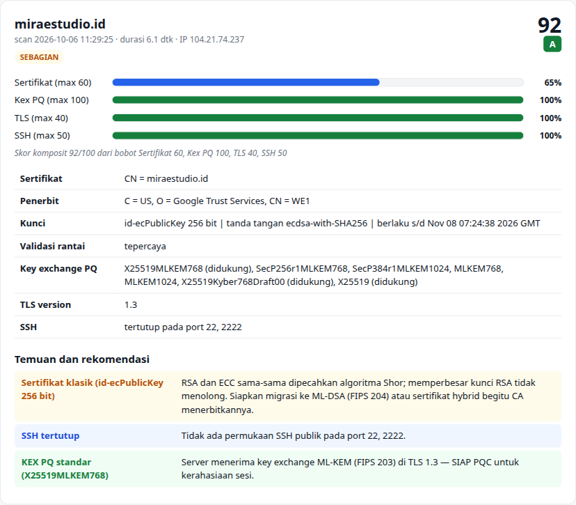

# SecScan PQC

[](https://github.com/Nael-Nathanael/secscan-pqc/actions/workflows/ci.yml)
[](LICENSE)

SecScan PQC checks how ready a server is for post-quantum cryptography (PQC) by probing it from the outside. It looks at the
TLS key exchange (ML-KEM), the certificate, the TLS versions on offer, and SSH, scores each one, and produces a PDF report.
The scans are read-only: SecScan sends protocol hellos, reads the server's first reply, and disconnects.

The web UI and reports are in Bahasa Indonesia. A hosted instance runs at [sec-scan.miraestudio.id](https://sec-scan.miraestudio.id).
The full methodology and the theory behind it are at [`/metodologi`](https://sec-scan.miraestudio.id/metodologi).



## What it checks

| Check | Weight | Full marks when |
|---|---:|---|
| PQ key exchange (TLS 1.3) | 100 | The server accepts a standard ML-KEM group such as `X25519MLKEM768` |
| Certificate | 60 | The leaf certificate uses ML-DSA or SLH-DSA |
| SSH (ports 22, 2222) | 50 | SSH is closed, or offers `mlkem768x25519-sha256` with an ed25519 host key and no RSA host key |
| TLS versions | 40 | Only TLS 1.3 is enabled |

The composite score is the weighted average of the selected checks. Grades: A ≥ 90, B ≥ 80, C ≥ 65, D ≥ 50, E < 50.

**The highest score a public website can reach today is 92.** No public CA issues ML-DSA certificates yet, so every
classical certificate (RSA ≥ 2048, ECDSA ≥ 256, EdDSA) scores 65% on the certificate check. Shor's algorithm breaks RSA and ECC
alike, so SecScan scores them the same: a bigger RSA key earns nothing.

## How the probes work

- **TLS versions and PQ groups** use hand-built ClientHello messages, so results don't depend on the TLS library on the scanning
  machine. For each PQ group, SecScan offers that single group with an empty key share. A server that supports the group must
  reply with a HelloRetryRequest naming it ([RFC 8446 §4.1.4](https://www.rfc-editor.org/rfc/rfc8446#section-4.1.4)), so the
  scanner never needs an ML-KEM implementation.
- **Certificates** come from a normal TLS handshake. A second handshake validates the chain and hostname against the system
  trust store.
- **SSH** reads the server banner and the cleartext `KEXINIT` message, then disconnects before authentication.

Targets must resolve to public addresses. Private, loopback and link-local addresses are refused.

## Run it

With Docker:

```sh
cp .env.example .env    # optional: set SCAN_PASSWORD, PORT, SITE_NAME
docker compose up -d --build
```

The app listens on `127.0.0.1:${PORT:-8000}`. Put a reverse proxy with TLS in front of it. Host-specific settings can also
go in a `compose.override.yaml`, which git ignores.

For local development (Python 3.12+):

```sh
python -m venv .venv
.venv/bin/pip install -r requirements-dev.txt
cd app && ../.venv/bin/uvicorn main:app --reload
```

## Configuration

All variables are optional. See [`.env.example`](.env.example).

| Variable | Default | Purpose |
|---|---|---|
| `SCAN_PASSWORD` | empty | Shared password, sent in the `X-Scan-Password` header. Empty disables it. |
| `PORT` | `8000` | Host port in `compose.yaml` |
| `BRAND_NAME` | `SecScan PQC` | Name printed on PDF reports |
| `SITE_NAME` | empty | Hostname printed on PDF reports, which also link to `/metodologi` |
| `MAX_CONCURRENT_HOSTS` | `4` | Hosts scanned in parallel |
| `RATE_LIMIT_HOSTS` | `40` | Hosts per client IP per 10 minutes |

The client IP used for rate limiting comes from the `CF-Connecting-IP` header when present, then from the proxy headers
(uvicorn runs with `--proxy-headers`). If you do not run behind Cloudflare, make sure your proxy strips or overwrites
`CF-Connecting-IP`, or clients can spoof it to dodge the rate limit.

## API

| Method | Path | Description |
|---|---|---|
| `POST` | `/api/scan` | Body `{"targets": ["example.com", "host:8443"], "checks": ["kex", "cert", "tls", "ssh"]}`. Up to 4 targets. Returns the results and a scan `id`. |
| `GET` | `/api/report/{id}.pdf` | PDF report for a recent scan (the last 200 are kept in memory) |
| `GET` | `/healthz` | Health check |

## Limitations

- Only one IP per target is scanned (the first IPv4 address, if any).
- Behind a CDN or reverse proxy, SecScan sees the edge, not the origin.
- It only sees the public HTTPS and SSH surface. VPNs, internal services, JWTs, stored data and firmware signing need a
  cryptographic inventory (CBOM) instead.
- Only the leaf certificate is scored.

## Responsible use

Scan only systems you own or have permission to test. The probes are light, but they are still unsolicited connections.

## Contributing

See [CONTRIBUTING.md](CONTRIBUTING.md). Report security issues privately as described in [SECURITY.md](SECURITY.md).

## Bahasa Indonesia

SecScan PQC memeriksa kesiapan kriptografi tahan kuantum sebuah server dari sisi luar: key exchange ML-KEM, sertifikat,
versi TLS, dan SSH, lalu membuat laporan PDF. Penjelasan lengkap cara menilai dan dasar teorinya ada di halaman
[Metodologi & landasan teori](https://sec-scan.miraestudio.id/metodologi). Laporan bug dan kontribusi boleh dalam
Bahasa Indonesia.

## License

[Apache License 2.0](LICENSE)
